# Terrascope Case Study

## High-level diagram

## Project delivery

### Principles

Rooted in Agile principles and a Product Mindset, the following customer-centric delivery plan aims to slice feature development to achieve small-yet-frequent value-add deliveries.

The Product Team and the customers will collaborate _directly_ to codevelop the product by prioritizing value-adds, and tweaking, reworking, or pivoting early until efforts achieve customer success. We will avoid information relays or silos, sometimes observed when the Product Team is not directly connected to the customers. Doing so, we aim to engage the Product Team beyond coding, and engage customers in building the product they love, thereby fostering Employees and Customers retention.

NB. The plan that follows should be challenged and rearranged in the face of market changes, customer feedback, or a shift in business priorities. It represents an optimistic strategy to construct the product from scratch.

### Sliced delivery plan

#### 🚀 Delivery #1

**Objective**

Start onboarding customers. Evaluate the UX of file uploads. Discover the heterogeneity of customers' data.

**Key product increments**

- Simple frontend with `Basic` Auth, activities upload form;
- API to upload activities as a CSV file and log individual activities;
- S3 bucket to store uploaded activities;
- Terraform scripts;
- Continuous delivery with Github Actions

#### 🚀 Delivery #2

**Objective**

Early AI Matcher discovery: discover challenges, risks, API differences, etc.

**Key product increments**

- Activities are individually pushed to the AI Matcher through an SQS queue with a unique lambda listener (concurrency = 1)
- AI Matcher results queued with SQS. A unique lambda listener calculates the activity emissions and records them in the DB
- AI Matcher failures forwarded to a dead letter queue.
- Frontend shows a paginated table of the activities and their respective emissions

#### 🚀 Delivery #3

**Objective**

Enable the system to scale considering the AI Matcher performance and scale constraints

**Key product increments**

- Enable up to 10 concurrent requests to the AI matcher
- Trigger the AI Matcher when the activity has no reusable historical data (a form of caching with our database)
- Enable concurrent processing of AI Matcher results

#### 🚀 Delivery #4

**Objective**

Near real time visibility on health of the infrastructure.

**Key product increments**

- Monitoring dashboard with Cloudwatch
- Thresholds defined (queues, dead-letter queues, lambda invocations, latencies, cpu/memory usage)
- Alarms set up

#### 🚀 Delivery #5

**Objective**

Isolate customers and upgrade authentication.

**Key product increments**

- Single tenant infrastructure (dedicated AWS infrastructure per tenant). Terraform scripts refactored accordingly.
- AWS Cognito to support user authentication

#### 🚀 Delivery #6

**Objective**

Distinct user accounts (accountants and viewers) with adequate authorizations.

**Key product increments**

- Accountant user type can upload and view activities
- Viewers can view activities
