# Terrascope Case Study

## INBOX

[ ] Risks and mitigations
[ ] Review delivery plan
[ ] Review principples
[ ] Did I document single-tenant infra?
[ ] Document assumptions

## Key workflows

### File processing workflow

When an accountant uploads a file, the system begins by creating a record in the database to track that upload. At the same time, it issues a pre-signed URL, allowing the file to be uploaded securely and directly to an S3 bucket without passing through our servers.

Once the upload completes, the system detects the file’s presence and updates its status accordingly. A background process then takes over to parse the file and ingest the business activity data it contains.

If every row in the file is valid, the data is ingested successfully, and the upload is marked as parsed. But if even a single row contains an error—such as an unrecognized unit or malformed value—the entire file is rejected. No data is ingested, and the system records the reason for failure.

This all-or-nothing approach is intentional. While it may seem strict, it is actually more convenient for the accountant: partial ingestion would mean they’d have to manually split, clean, and resubmit parts of the file. By clearly rejecting problematic files as a whole, we enable faster correction and clearer accountability, without the risk of silently skipping or partially processing important data.

This workflow ensures clean, reliable data while keeping the user experience straightforward and predictable.


### Activity emission factor matching workflow

After activities are parsed and stored in the system, the backend attempts to match each activity to an emission factor. To optimize performance and reduce reliance on a third-party service, the system first checks its internal database to see if a similar activity has already been matched in the past.

If a suitable match is found — for example, an identical description and unit combination from another user or file — the system reuses the previously matched emission factor and immediately calculates the emissions. This process is fast, transparent, and auditable.

If no match is found in the system, the activity is sent to the external AI Matcher.

When a valid result is returned, the system calculates the emissions and stores the matched factor, the result, and the confidence. If the AI fails to provide a match, the activity is marked as failed with a reason recorded for visibility.

This hybrid approach gives us the best of both worlds: performance and scalability via caching, and accuracy and flexibility via the AI matcher when needed. It also helps us reduce latency, control costs, and serve more customers reliably as the system grows.



## Project delivery

### Principles

Rooted in Agile principles and a Product Mindset, the following customer-centric delivery plan aims to slice feature development to achieve small-yet-frequent value-add deliveries.

The Product Team and the customers will collaborate _directly_ to codevelop the product by prioritizing value-adds, and tweaking, reworking, or pivoting early until efforts achieve customer success. We will avoid information relays or silos, sometimes observed when the Product Team is not directly connected to the customers. Doing so, we aim to engage the Product Team beyond coding, and engage customers in building the product they love, thereby fostering Employees and Customers retention.

NB. The plan that follows should be challenged and rearranged in the face of market changes, customer feedback, or a shift in business priorities. It represents an optimistic strategy to construct the product from scratch.

### Sliced delivery plan

#### 🚀 Delivery #1

**Objective**

Start onboarding customers. Evaluate the UX of file uploads. Discover the heterogeneity of customers' data.

**Key product increments**

- Simple frontend with `Basic` Auth, activities upload form;
- API to upload activities as a CSV file and log individual activities;
- S3 bucket to store uploaded activities;
- Terraform scripts;
- Continuous delivery with Github Actions

#### 🚀 Delivery #2

**Objective**

Early AI Matcher discovery: discover challenges, risks, API differences, etc.

**Key product increments**

- Activities are individually pushed to the AI Matcher through an SQS queue with a unique lambda listener (concurrency = 1)
- AI Matcher results queued with SQS. A unique lambda listener calculates the activity emissions and records them in the DB
- AI Matcher failures forwarded to a dead letter queue.
- Frontend shows a paginated table of the activities and their respective emissions

#### 🚀 Delivery #3

**Objective**

Enable the system to scale considering the AI Matcher performance and scale constraints

**Key product increments**

- Enable up to 10 concurrent requests to the AI matcher
- Trigger the AI Matcher when the activity has no reusable historical data (a form of caching with our database)
- Enable concurrent processing of AI Matcher results

#### 🚀 Delivery #4

**Objective**

Near real time visibility on health of the infrastructure.

**Key product increments**

- Monitoring dashboard with Cloudwatch
- Thresholds defined (queues, dead-letter queues, lambda invocations, latencies, cpu/memory usage)
- Alarms set up

#### 🚀 Delivery #5

**Objective**

Isolate customers and upgrade authentication.

**Key product increments**

- Single tenant infrastructure (dedicated AWS infrastructure per tenant). Terraform scripts refactored accordingly.
- AWS Cognito to support user authentication

#### 🚀 Delivery #6

**Objective**

Distinct user accounts (accountants and viewers) with adequate authorizations.

**Key product increments**

- Admin account can invite users and set their role via Admin page
- Accountant user type can upload and view activities
- Viewers can view activities

## Technical implementation

### High-level diagram


### Key API endpoints

#### API Versionning

We introduce API versionning now, not because multiple API versions are already designed but because now is the easiest time to account for multiple API versions in our API design. We are using a simple, REST-friendly, and cache-friendly "URI-based versioning" strategy where the version is specified in a URI path. For exanple:

> GET /v1/home

#### Common errors

| HTTP Status code | Reason |
|------------------|--------|
| 400 | Invalid request. The payload or the JWT token cannot be parsed. |
| 401 | Unauthorized. The JWT token is missing or has expired. |
| 403 | The authenticated user lacks sufficient privileges to access the requested resource. Do they have the adequate role? |
| 404 | The resource does not exist. |

#### Authentication

##### POST /v1/auth/login

**Request payload**

```json
{
  "credentials": {
    "login": string,
    "password": string
  }
}
```

**Response**

When signing in succeeds, the API responds with a 200 status code and a JWT token in the payload. The JWT encodes the user's unique identity as a `uuid` and its `role` ("accountant" or "viewer")

```json
{
  "jwt": string
}
```

##### GET /v1/me

**Request headers**

```
Authorization: Bearer <jwt token>
```

**Response**

When the JWT is valid (correct structure and hasn't expired), the API responds with a 200 status code and a payload with information about the signed in user.

```json
{
  "identity": {
    "firstname": string,
    "lastname": string,
  },
  "email": string,
  "preferences": {
    "marketing_opted_in": bool,
    time_format: 12 | 24,
    timezone: string
  }
}
```

#### Home page

##### GET /v1/home

**Request headers**

```
Authorization: Bearer <jwt token>
```

**Response**

When the JWT is valid (correct structure and it hasn't expire), the API responds with a 200 status code and a payload with data to render on the home page for the signed in user:

```json
{
  "announcement": string, // upcoming release, scheduled maintenance, etc.
  "product_tips" : [ // illustrative - a list of product tips to display
    {
      "title": string,
      "description": string,
      "permalink": url
    }
  ]
}
```

#### System data

##### GET /v1/system/essentials

This endpoint provides essential information about the system to any user, regardless of their authentication state.

**Response**

```json
{
  "help_url": url,
  "support_email": email,
  "version": string,
}
```

##### GET /v1/system/feature_flags

This endpoint provides the list of feature-flags enabled for the authenticated user. Flags may not be enable to all users as they might require a specific `role`
r be assigned by an A/B testing policy depending on the user's cohort.

**Request headers**

```
Authorization: Bearer <jwt token>
```

**Response**

Assuming a valid jwt token (structure and expiry check), the endpoint responds with a 200 status code and a list of flags enabled for the authenticated user.

```json
[string]
```

**Example**

```json
[
  "product_tips", // product tips can be displayed
  "dark_theme_selector" // the dark theme selector can be displayed
]
```

Another user may simultaneously get the following feature flags:

```json
[
  "product_tips"
]
```

#### Activities upload

##### GET /v1/upload/new

Generates a pre-signed url allowing the authenticated accountant to upload a CSV file to our private S3 bucket.

**Request header**

```
Authorization: Bearer <jwt token>
```

**Response**

A `200` status code with a pre-signed url in the response body.

```json
https://terrascope-clientxxxx-s3-bucket.s3.us-west-2.amazonaws.com/key?X-Amz-Algorithm=AWS4-HMAC-SHA256&X-Amz-Credential=AKIAEXAMPLE123456789%2F20210621%2Fus-west-2%2Fs3%2Faws4_request&X-Amz-Date=20210621T041609Z&X-Amz-Expires=3600&X-Amz-SignedHeaders=host&X-Amz-Signature=EXAMBLE1234494d5fba3fed607f98018e1dfc62e2529ae96d844123456
```

##### POST /v1/upload

Notify the API of a successful file upload to S3.

**Request header**

```
Authorization: Bearer <jwt token>
```

**Request payload**

```json
{
  "presigned_url": url
}
```

**Response**

The API responds with a `204` status and an empty body.

##### GET /v1/activities

This endpoint responds with a paginated list of activities data, and metadata such as their current ingestion status.

**Request headers**

```
Authorization: Bearer <jwt token>
```

**Query parameters**

| Name | Default | Description |
| --- | --- | --- |
| offset | 0 | A positive integer to position the beginning of the page |
| limit | 25 | A positive number to set the number of activities on that page |

**Response**

The response payload contains activities that match the page specified with the query parameters. The original activities data and their processing status are returned.

```json
{
  "offset": positive int,
  "limit": positive int,
  "activities": [
    {
      "id": uuid,
      "url": url,
      "emissions": {
        "pollutant": {
          "id": uuid,
          "name": string
        },
        "amount": {
          "unit": string,
          "quantity": float
        }
      },
      "emission_factor": {
        "name": string,
        "url": url
      },

      ...original activity data...

      "metadata": {
        "status": "ingested" | "matching" | "computing" | "success" | "failure",
        "ingested_on": datetime,
        "updated_at": datetime,
        "submitted_by": user account
      }
    }
  ]
}
```

### Data schema

```sql
CREATE TYPE role AS ENUM ('admin', 'accountant', 'viewer');

CREATE TABLE users (
    id UUID PRIMARY KEY DEFAULT gen_random_uuid(),

    cognito_sub UUID UNIQUE NOT NULL,       -- From Cognito's `sub` claim
    email TEXT UNIQUE NOT NULL CHECK (email ~* '^[^@]+@[^@]+\.[^@]+$'),

    first_name TEXT,
    last_name TEXT,

    role role NOT NULL DEFAULT 'viewer',

    created_at TIMESTAMPTZ NOT NULL DEFAULT now(),
    updated_at TIMESTAMPTZ NOT NULL DEFAULT now()
);

CREATE TABLE emission_factors (
    id UUID PRIMARY KEY DEFAULT gen_random_uuid(),

    name TEXT NOT NULL,                          -- Human-readable label
    activity_type TEXT NOT NULL,                 -- Category for matching, e.g. "electricity", "freight"
    unit TEXT NOT NULL,                          -- Unit expected from user (e.g. "kWh", "liters")
    factor_value NUMERIC NOT NULL,               -- Emission factor value (e.g. 0.408)
    factor_unit TEXT NOT NULL,                   -- Typically "kgCO2e"

    source TEXT,                                 -- Short citation (e.g. "EPA 2022")
    year INTEGER,                                -- Optional versioning
    geography TEXT,                              -- Optional: "SG", "EU", "US"...

    created_at TIMESTAMPTZ NOT NULL DEFAULT now(),
    updated_at TIMESTAMPTZ NOT NULL DEFAULT now()
);

CREATE TYPE activity_status AS ENUM (
    'ingested',
    'matching',
    'calculated',
    'failed'
);

CREATE TABLE activities (
    id UUID PRIMARY KEY DEFAULT gen_random_uuid(),

    upload_id UUID NOT NULL REFERENCES uploads(id),
    row_number INTEGER,                             -- Position in uploaded file
    raw_description TEXT NOT NULL,                  -- User-provided or parsed activity label
    raw_volume NUMERIC,                             -- e.g., 1000
    raw_unit TEXT,                                  -- e.g., "kWh", "liters"

    status activity_status NOT NULL DEFAULT 'ingested',

    matched_factor_id UUID REFERENCES emission_factors(id),   -- Set by processing worker
    factor_confidence NUMERIC,                                -- Optional (from AI)
    emissions NUMERIC,                                        -- Final computed result
    emissions_unit TEXT,                                      -- Typically "kgCO2e"

    failure_reason TEXT,                                      -- Why it failed, if applicable

    created_at TIMESTAMPTZ NOT NULL DEFAULT now(),
    updated_at TIMESTAMPTZ NOT NULL DEFAULT now()
);

CREATE TYPE upload_status AS ENUM (
    'pending_upload',   -- Pre-signed URL issued, waiting for file to be uploaded to S3
    'uploaded',         -- File is now present in S3
    'parsing',          -- Worker is ingesting activities
    'parsed',           -- Successfully parsed
    'failed'            -- Fatal error during parsing
);

CREATE TABLE uploads (
    id UUID PRIMARY KEY DEFAULT gen_random_uuid(),

    accountant UUID NOT NULL REFERENCES users(id),
    s3_object_url TEXT NOT NULL UNIQUE,                      -- S3 key or full URL to file

    status upload_status NOT NULL DEFAULT 'pending_upload',
    failure_reason TEXT,

    created_at TIMESTAMPTZ NOT NULL DEFAULT now(),
    updated_at TIMESTAMPTZ NOT NULL DEFAULT now()
);
```
