# Terrascope Case Study

## High-level diagram

```mermaid
architecture-beta
  group activity-ingestion(database)[Activities ingestion]
    service client-activity-queue(logos:aws-sqs)[Client activities queue] in activity-ingestion
    service cache-aware-router(logos:aws-lambda)[Cache aware router] in activity-ingestion
    service ai-matcher(cloud)[AI Matcher] in activity-ingestion
    service ef-results-queue(logos:aws-sqs)[EF results queue] in activity-ingestion
    service ef-results-processor(logos:aws-lambda)[EF result processor] in activity-ingestion

    junction ai-matcher-to-queue in activity-ingestion

    client-activity-queue:B --> T:cache-aware-router
    cache-aware-router:L --> R:ai-matcher

    ai-matcher:B -- T:ai-matcher-to-queue
    ai-matcher-to-queue:R --> L:ef-results-queue

    junction router-store-processor in activity-ingestion
    cache-aware-router:R -- L:router-store-processor
    ef-results-queue:R --> L:ef-results-processor
    ef-results-processor:T -- B:router-store-processor

  group backend-support-systems(cloud)[Backend support systems]
    service auth(logos:aws-cognito)[Auth by Cognito] in backend-support-systems
    service iam(logos:aws-iam)[Identity Management by IAM] in backend-support-systems
    service kms(logos:aws-kms)[Key Management by KMS] in backend-support-systems
    service cloudwatch(logos:aws-cloudwatch)[Logs Monitoring and Alarms by Cloudwatch] in backend-support-systems

    junction support1 in backend-support-systems
    junction support2 in backend-support-systems

    iam:B -- T:support1
    auth:T -- B:support1
    support1:L -- R:support2
    kms:B -- T:support2
    cloudwatch:T -- B:support2

  group backend(server)[Backend]
    service api-gateway(logos:aws-api-gateway)[API by API Gateway] in backend
    service lambdas(logos:aws-lambda)[Lambdas] in backend
    service submited_activities_bucket(logos:aws-s3)[Submitted activities store by S3 presigned URLs] in backend
    service emissions-store(logos:aws-aurora)[Emissions store by Aurora] in backend

    junction frontend-backend in backend
    junction frontend-backend-left in backend
    junction frontend-backend-right in backend
    
    junction public-lambdas in backend

    api-gateway:R -- L:public-lambdas
    submited_activities_bucket:L -- R:public-lambdas
    public-lambdas:B -- T:lambdas

    lambdas:B -- T:client-activity-queue

    lambdas{group}:L -- R:support1
    frontend-backend:L -- R:frontend-backend-left
    frontend-backend:R -- L:frontend-backend-right
    frontend-backend-left:B -- T:api-gateway
    frontend-backend-right:B -- T:submited_activities_bucket
  
    junction lambdas-emissions-store in backend 
    lambdas:R -- L:lambdas-emissions-store
    lambdas-emissions-store:B -- T:emissions-store
    emissions-store:B -- T:router-store-processor

  group frontend(internet)[Frontend]
    service browser(logos:react)[React Frontend] in frontend
    service cdn(logos:aws-cloudfront)[CDN] in frontend
    service frontend-bucket(logos:aws-s3)[Frontend sources] in frontend

    browser:R -- L:cdn
    browser{group}:B -- T:frontend-backend
    cdn:R -- L:frontend-bucket

  group cicd(cloud)[CICD]
    service vcs(logos:github-icon)[Github] in cicd
    service continuous-delivery(logos:github-actions)[CICD pipeline by Github Actions] in cicd
    service iac(logos:terraform-icon)[Infra as Code by Terraform] in cicd
    
    junction cicd1 in cicd
    vcs:R -- L:cicd1
    iac:L -- R:cicd1 
    cicd1:B -- T:continuous-delivery
```

## Project delivery

### Principles

Rooted in Agile principles and a Product Mindset, the following customer-centric delivery plan aims to slice feature development to achieve small-yet-frequent value-add deliveries.

The Product Team and the customers will collaborate _directly_ to codevelop the product by prioritizing value-adds, and tweaking, reworking, or pivoting early until efforts achieve customer success. We will avoid information relays or silos, sometimes observed when the Product Team is not directly connected to the customers. Doing so, we aim to engage the Product Team beyond coding, and engage customers in building the product they love, thereby fostering Employees and Customers retention.

### Sliced delivery plan

#### Delivery #1

**Objective**

Start onboarding customers. Evaluate the UX of file uploads. Discover the heterogeneity of customers' data.

**Key product increments**

- Simple frontend with `Basic` Auth, activities upload form, and non-paginated activity viewer;
- API to upload activities file and store individual activities in the database
- S3 bucket to store uploaded activities

#### Delivery #2

**Objective**

fixme

**Key product increments**

fixme
