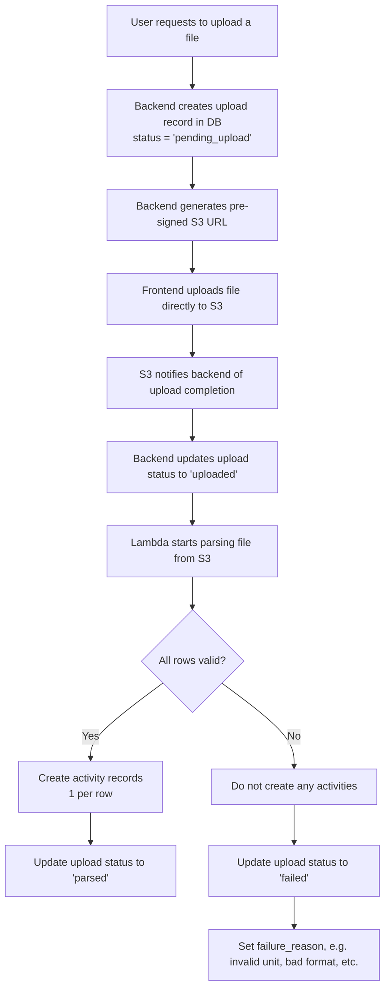
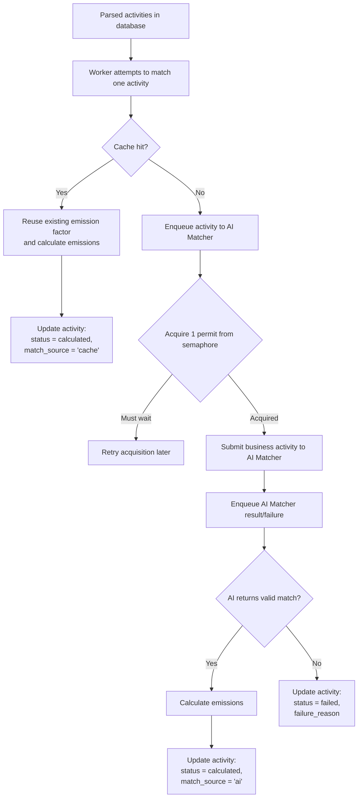

# Terrascope Case Study

## Actors

Various actors use or develop the service. Rather than calling them with vague names such as "users", an effort is made to identify them by their role.

- An "accountant" is a customer who uploads their business activities to the service.
- A "viewer" can consult uploaded business activities and notably their status.

## Supporting assumptions

Based on the document provided to support this exercise, certain assumptions were made to design the processes and infrastructure of this Carbon Accounting Platform. This section documents these assumptions.

1. Regulations, prospects, and customers tolerate building our platform on a public cloud such as AWS.
2. The AI Matcher service doesn't belong to Terrascope. Terrascope does not define its roadmap. Terrascope cannot invest in improving this service scalability or performance.
3. The AI Matcher service can be consumed via a secure HTTP API. This API has back-pressure mechanisms built in such as rate-limiting and throttling.
3. Among the reported activities, some reoccur periodically. For example, a Singapore-based supermarket's electricity bill remains comparable on two consecutive months.
4. Accountants can import their activities as a CSV file.

## Key workflows

### File processing workflow

When an accountant uploads a file, the system begins by creating a record in the database to track that upload. At the same time, it issues a pre-signed URL (AWS S3 feature), allowing the file to be uploaded securely and directly to an S3 bucket directly from the browser.

Once the upload completes, the system detects the file’s presence based on S3 notifications and updates its status accordingly in the database. A background process then takes over to parse the file and ingest its business activity data.

If every row in the file is valid, the data is ingested successfully, and the upload is marked as parsed. But if any row contains an error, such as an unrecognized unit or malformed value, the entire file is rejected. No data is ingested, and the system records the reason for failure.

This all-or-nothing approach is intentional. While it may seem strict, it is more convenient for the accountant: partial ingestion would mean they’d have to manually split, clean, and resubmit parts of the file. By clearly rejecting problematic files as a whole, we enable faster correction and clearer accountability, without the risk of silently skipping or partially processing important data.

This workflow ensures clean, reliable data while keeping the user experience straightforward and predictable.



### Activity emission factor matching workflow

After activities are parsed and stored in the system, the backend attempts to match each activity to an emission factor with heuristics and preexisting business activities.

If a suitable match is found, for example when a recent identical description and unit combination pre-exists, the system reuses the previously matched emission factor and immediately calculates the emissions. This process is fast, transparent, and auditable.

Otherwise, the activity is enqueued (Amazon SQS). Lambdas which act as a proxy to the external AI Matcher consume the queue. These "proxy lambdas" enable to load the AI Matcher service optimally, by handling rate-limiting responses gracefully and by controlling how many concurrent requests are sent to the AI Matcher. To that end, we use a distributed semaphore detailed later in this document.

When the matching ends, the AI Matcher service enqueues the result (see EF result queue in the high level diagram). We also use this event to release a slot back to the distributed semaphore.

When the AI Matcher enqueues a successful matching the system calculates the emissions and stores the matched factor, the result, and the confidence. If the AI Matcher fails to match the activity to a factor, we mark the activity as failed with the reason provided by the matcher service in our database.

This hybrid approach gives us the best of both worlds: performance and scalability via caching, and accuracy and flexibility via the AI matcher when needed. It also helps us reduce latency, control costs, and serve more customers reliably as the system grows. Accountants gain full transparency over the status of their uploaded business activities.

NB. No guideline was provided about the possible integration mechanisms support by the AI Matcher (webhook, queue, socket, etc.) so a queue has been selected. The queue could be wrapped by API Gateway to ease the integration with the AI Matcher service should the queue solution be unsupported.



### UI workflows

This case study doesn't emphasize key UI or UX requirements beyond the need to upload activities and paginate the display of the results. Here are some additional consideration to enhance the customer experience that could be considered without altering the architecture proposed in this document (or lightly).

1. Display the status of each activity to give a sense of processing progress.
2. Asking for support related to an activity, especially when its processing failed or to challenge its result.
3. Exporting a report (or various report). From a customer-centric viewpoint, calculating the emissions of their activities isn't an end in itself. The value of Terrascope's product lies in supporting the clients with analysis, reporting (internally, to auditors, or to regulators), and decision-making.
4. Managing collaboration within each client account with roles.
5. Viewing a trail of uploads (what, who, when)
6. Asking for general support.
7. Displaying product tips
8. Customer feedback submission

## Project delivery

### Principles

### 🚀 Project Delivery Principles

Our delivery approach is grounded in Agile principles with a customer-centric focus and incremental impact.

Rather than building the platform layer by layer (e.g. database first, then API, then UI), we slice features **vertically**, delivering complete, usable subsets of functionality in each iteration. This approach enables faster feedback, earlier value creation, and de-risks technical dependencies as we go.

Here’s how we would structure initial delivery:

- **Sprint 1**: Onboard customers with accounts and activities uploads. Prepare foundational infrastructure.
- **Sprint 2**: Integrate the AI Matcher service, unoptimized. Display activities status on the frontend.
- **Sprint 3**: Mitigate AI Matcher service performance & scalability limits.
- **Sprint 4**: Industrialize the product with observability tools.
- **Sprint 5+**: Secure the platform by isolating customers with a single tenant infrastructure.

Each sprint delivers vertical value to the user while keeping the system extensible. This ensures that we move fast without accumulating rework — and that we’re always aligned with real customer needs. We notably and deliberately start by creating real customer-value to validate our assumptions early, and "productionize" the architecture soon after.

### Sliced delivery plan

The plan that follows should be challenged and rearranged in the face of market changes, customer feedback, or a shift in business priorities. It represents an optimistic strategy to construct the product from scratch.

#### 🚀 Delivery #1

**Objective**

Start onboarding customers. Evaluate the UX of file uploads. Discover the heterogeneity of customers' data.

**Key product increments**

- Simple frontend with Cognito based authentication, activities upload form;
- API to upload activities as a CSV file with pre-signed URLs (S3)
- S3 bucket to store uploaded activities;
- Terraform scripts;
- Continuous delivery with Github Actions

#### 🚀 Delivery #2

**Objective**

Early AI Matcher discovery: discover challenges, risks, API differences, etc.

**Key product increments**

- Activities are individually pushed to the AI Matcher through an SQS queue with a unique lambda listener (concurrency = 1)
- AI Matcher results queued with SQS. A unique lambda listener calculates the activity emissions and records them in the DB
- Frontend shows a paginated table of the activities and their respective emissions

#### 🚀 Delivery #3

**Objective**

Enable the system to scale considering the AI Matcher performance and scale constraints

**Key product increments**

- Enable up to 10 concurrent requests to the AI matcher
- Trigger the AI Matcher when the activity has no reusable historical data (a form of caching with our database)
- Enable concurrent processing of AI Matcher results

#### 🚀 Delivery #4

**Objective**

Near real time visibility on health of the infrastructure.

**Key product increments**

- Monitoring dashboard with Cloudwatch
- Thresholds defined (queues, dead-letter queues, lambda invocations, latencies, cpu/memory usage)
- Alarms set up

#### 🚀 Delivery #5

**Objective**

Isolate customers' organisation

**Key product increments**

- Single tenant infrastructure (dedicated AWS infrastructure per tenant). Terraform scripts refactored accordingly.

#### 🚀 Delivery #6

**Objective**

Distinct user accounts (accountants and viewers) with adequate authorizations.

**Key product increments**

- Admin account can invite users and set their role via Admin page
- Accountant user type can upload and view activities
- Viewers can view activities

## Technical implementation

### Key infrastructure choices

#### Storage

Our platform uses Amazon S3 to store uploaded files and Amazon Aurora (PostgreSQL-compatible) for structured data. This combination gives us a storage foundation that scales effortlessly while maintaining strong performance and low latency.

S3 is ideal for file uploads. It handles virtually unlimited volumes of data without manual scaling. Files are uploaded directly from the browser to S3 using secure pre-signed URLs, which offloads our backend and speeds up ingestion. It’s highly durable, cost-effective, and performs reliably regardless of file size or upload frequency.

Aurora is used for all structured records: users, activities, emission factors, and processing results. It offers the reliability and familiarity of PostgreSQL, but with built-in scalability, replication, and automated failover. Reads and writes remain fast even as data volume and concurrency increase.

This architecture ensures that as more customers join the platform, and as activity volumes grow, the system remains responsive, reliable, and easy to operate — without introducing unnecessary complexity or future rework.

#### Security, Identity, and Access Management

We’ve chosen a single-tenant infrastructure model to serve customers independently and securely. Each tenant’s data and workflows are isolated by design, which simplifies compliance, improves fault isolation, and builds customer trust. It also allows for flexible, per-client deployment options down the line — including on-prem or region-specific instances if needed.

User authentication and access control are handled by AWS Cognito, with permissions delegated via IAM roles where appropriate. Cognito offloads the complexity of secure user management — including login, MFA, and token issuance — while integrating natively with other AWS services. IAM gives us fine-grained control over internal service access, ensuring that background workers, parsers, and upload handlers operate with the minimum privileges required.

This setup aligns with our goals of fast onboarding, secure data isolation, and a scalable operational model — without introducing the overhead of building identity infrastructure from scratch.

#### Compute and Messaging

Our architecture uses AWS Lambda for compute, API Gateway for exposing secure endpoints, and SQS for asynchronous task management. This setup is designed to handle variable workloads efficiently while keeping infrastructure lean and responsive.

Lambda gives us event-driven scalability with no servers to manage. It’s ideal for workflows like parsing, matching, and post-processing that happen in response to events (file uploaded, match returned, etc.). We only pay for what we use, which is cost-effective during early growth and safe under heavy load.

API Gateway exposes our endpoints securely and scalably. It handles authentication, rate limiting, and throttling, giving us production-grade request handling without standing up full web servers.

SQS decouples components and adds resilience. It buffers incoming tasks — like matching activities or ingesting uploads — and ensures they’re retried on failure without blocking other operations. This makes the system more fault-tolerant and keeps each service focused on a single responsibility.

Together, these services allow us to build a scalable, cost-conscious platform that responds well under load, handles bursts gracefully, and remains easy to evolve over time.

#### Management of the AI Matcher service load

To ensure strict concurrency limits when interacting with the AI Matcher service, we introduced a distributed semaphore backed by Aurora. This mechanism guarantees that no more than a fixed number of requests (e.g., 10) are in-flight at any given time, aligning with the matcher’s capacity constraints. By leveraging Aurora's transactional capabilities and row-level locking, we can safely and efficiently coordinate access across multiple concurrent workers using a single atomic SQL query. This approach eliminates the need for additional infrastructure (like Redis or DynamoDB), fits seamlessly into our existing architecture, and provides transparent, auditable control over request throttling.

#### Programming languages and frameworks

The infrastructure we’ve chosen gives us the freedom to use the right tools for each job — without being locked into a single language or framework.

Today, we can confidently build around JavaScript, Python, and React, technologies already in use at Terrascope. These choices support rapid development, ease of hiring, and consistency across frontend and backend teams.

Because our architecture is event-driven and loosely coupled — with SQS, Lambda, and containerized workers — it’s straightforward to introduce new languages where they bring clear advantages. For example, we could add Go for fast, concurrent processing or Rust for low-latency data transformation tasks, without needing to rearchitect the system.

This flexibility allows us to evolve the platform gradually, scale specialized components when needed, and stay aligned with both developer preferences and technical demands as we grow.

### High-level diagram


### Key API endpoints

#### API Versionning

We introduce API versionning now, not because multiple API versions are already designed but because now is the easiest time to account for multiple API versions in our API design. We are using a simple, REST-friendly, and cache-friendly "URI-based versioning" strategy where the version is specified in a URI path. For exanple:

> GET /v1/home

#### Common errors

| HTTP Status code | Reason |
|------------------|--------|
| 400 | Invalid request. The payload or the JWT token cannot be parsed. |
| 401 | Unauthorized. The JWT token is missing or has expired. |
| 403 | The authenticated user lacks sufficient privileges to access the requested resource. Do they have the adequate role? |
| 404 | The resource does not exist. |

#### Authentication

##### POST /v1/auth/login

**Request payload**

```json
{
  "credentials": {
    "login": string,
    "password": string
  }
}
```

**Response**

When signing in succeeds, the API responds with a 200 status code and a JWT token in the payload. The JWT encodes the user's unique identity as a `uuid` and its `role` ("accountant" or "viewer")

```json
{
  "jwt": string
}
```

##### GET /v1/me

**Request headers**

```
Authorization: Bearer <jwt token>
```

**Response**

When the JWT is valid (correct structure and hasn't expired), the API responds with a 200 status code and a payload with information about the signed in user.

```json
{
  "identity": {
    "firstname": string,
    "lastname": string,
  },
  "email": string,
  "preferences": {
    "marketing_opted_in": bool,
    time_format: 12 | 24,
    timezone: string
  }
}
```

#### Home page

##### GET /v1/home

**Request headers**

```
Authorization: Bearer <jwt token>
```

**Response**

When the JWT is valid (correct structure and it hasn't expire), the API responds with a 200 status code and a payload with data to render on the home page for the signed in user:

```json
{
  "announcement": string, // upcoming release, scheduled maintenance, etc.
  "product_tips" : [ // illustrative - a list of product tips to display
    {
      "title": string,
      "description": string,
      "permalink": url
    }
  ]
}
```

#### System data

##### GET /v1/system/essentials

This endpoint provides essential information about the system to any user, regardless of their authentication state.

**Response**

```json
{
  "help_url": url,
  "support_email": email,
  "version": string,
}
```

##### GET /v1/system/feature_flags

This endpoint provides the list of feature-flags enabled for the authenticated user. Flags may not be enable to all users as they might require a specific `role`
r be assigned by an A/B testing policy depending on the user's cohort.

**Request headers**

```
Authorization: Bearer <jwt token>
```

**Response**

Assuming a valid jwt token (structure and expiry check), the endpoint responds with a 200 status code and a list of flags enabled for the authenticated user.

```json
[string]
```

**Example**

```json
[
  "product_tips", // product tips can be displayed
  "dark_theme_selector" // the dark theme selector can be displayed
]
```

Another user may simultaneously get the following feature flags:

```json
[
  "product_tips"
]
```

#### Activities upload

##### GET /v1/upload/new

Generates a pre-signed url allowing the authenticated accountant to upload a CSV file to our private S3 bucket.

**Request header**

```
Authorization: Bearer <jwt token>
```

**Response**

A `200` status code with a pre-signed url in the response body.

```json
https://terrascope-clientxxxx-s3-bucket.s3.us-west-2.amazonaws.com/key?X-Amz-Algorithm=AWS4-HMAC-SHA256&X-Amz-Credential=AKIAEXAMPLE123456789%2F20210621%2Fus-west-2%2Fs3%2Faws4_request&X-Amz-Date=20210621T041609Z&X-Amz-Expires=3600&X-Amz-SignedHeaders=host&X-Amz-Signature=EXAMBLE1234494d5fba3fed607f98018e1dfc62e2529ae96d844123456
```

##### GET /v1/activities

This endpoint responds with a paginated list of activities data, and metadata such as their current ingestion status.

**Request headers**

```
Authorization: Bearer <jwt token>
```

**Query parameters**

| Name | Default | Description |
| --- | --- | --- |
| offset | 0 | A positive integer to position the beginning of the page |
| limit | 25 | A positive number to set the number of activities on that page |

**Response**

The response payload contains activities that match the page specified with the query parameters. The original activities data and their processing status are returned.

```json
{
  "offset": positive int,
  "limit": positive int,
  "activities": [
    {
      "id": uuid,
      "url": url,
      "emissions": {
        "pollutant": {
          "id": uuid,
          "name": string
        },
        "amount": {
          "unit": string,
          "quantity": float
        }
      },
      "emission_factor": {
        "name": string,
        "url": url
      },

      ...original activity data...

      "metadata": {
        "status": "ingested" | "matching" | "computing" | "success" | "failure",
        "ingested_on": datetime,
        "updated_at": datetime,
        "submitted_by": user account
      }
    }
  ]
}
```

### Data schema

```sql
CREATE TYPE role AS ENUM ('admin', 'accountant', 'viewer');

CREATE TABLE users (
    id UUID PRIMARY KEY DEFAULT gen_random_uuid(),

    cognito_sub UUID UNIQUE NOT NULL,       -- From Cognito's `sub` claim
    email TEXT UNIQUE NOT NULL CHECK (email ~* '^[^@]+@[^@]+\.[^@]+$'),

    first_name TEXT,
    last_name TEXT,

    role role NOT NULL DEFAULT 'viewer',

    created_at TIMESTAMPTZ NOT NULL DEFAULT now(),
    updated_at TIMESTAMPTZ NOT NULL DEFAULT now()
);

CREATE TABLE emission_factors (
    id UUID PRIMARY KEY DEFAULT gen_random_uuid(),

    name TEXT NOT NULL,                          -- Human-readable label
    activity_type TEXT NOT NULL,                 -- Category for matching, e.g. "electricity", "freight"
    unit TEXT NOT NULL,                          -- Unit expected from user (e.g. "kWh", "liters")
    factor_value NUMERIC NOT NULL,               -- Emission factor value (e.g. 0.408)
    factor_unit TEXT NOT NULL,                   -- Typically "kgCO2e"

    source TEXT,                                 -- Short citation (e.g. "EPA 2022")
    year INTEGER,                                -- Optional versioning
    geography TEXT,                              -- Optional: "SG", "EU", "US"...

    created_at TIMESTAMPTZ NOT NULL DEFAULT now(),
    updated_at TIMESTAMPTZ NOT NULL DEFAULT now()
);

CREATE TYPE activity_status AS ENUM (
    'ingested',
    'matching',
    'calculated',
    'failed'
);

CREATE TABLE activities (
    id UUID PRIMARY KEY DEFAULT gen_random_uuid(),

    upload_id UUID NOT NULL REFERENCES uploads(id),
    row_number INTEGER,                             -- Position in uploaded file
    raw_description TEXT NOT NULL,                  -- User-provided or parsed activity label
    raw_volume NUMERIC,                             -- e.g., 1000
    raw_unit TEXT,                                  -- e.g., "kWh", "liters"

    status activity_status NOT NULL DEFAULT 'ingested',

    matched_factor_id UUID REFERENCES emission_factors(id),   -- Set by processing worker
    factor_confidence NUMERIC,                                -- Optional (from AI)
    emissions NUMERIC,                                        -- Final computed result
    emissions_unit TEXT,                                      -- Typically "kgCO2e"

    failure_reason TEXT,                                      -- Why it failed, if applicable

    created_at TIMESTAMPTZ NOT NULL DEFAULT now(),
    updated_at TIMESTAMPTZ NOT NULL DEFAULT now()
);

CREATE TYPE upload_status AS ENUM (
    'pending_upload',   -- Pre-signed URL issued, waiting for file to be uploaded to S3
    'uploaded',         -- File is now present in S3
    'parsing',          -- Worker is ingesting activities
    'parsed',           -- Successfully parsed
    'failed'            -- Fatal error during parsing
);

CREATE TABLE uploads (
    id UUID PRIMARY KEY DEFAULT gen_random_uuid(),

    accountant UUID NOT NULL REFERENCES users(id),
    s3_object_url TEXT NOT NULL UNIQUE,                      -- S3 key or full URL to file

    status upload_status NOT NULL DEFAULT 'pending_upload',
    failure_reason TEXT,

    created_at TIMESTAMPTZ NOT NULL DEFAULT now(),
    updated_at TIMESTAMPTZ NOT NULL DEFAULT now()
);

CREATE TABLE matcher_semaphore (
  permit_id TEXT PRIMARY KEY,
  locked BOOLEAN NOT NULL DEFAULT FALSE,
  expires_at TIMESTAMPTZ
);

-- Seed the semaphore with 10 permits
INSERT INTO matcher_semaphore(permit_id)
SELECT 'permit-' || i
FROM generate_series(0, 9) AS i;

-- Index to support sorting and filtering by activity date (e.g. for UI display)
CREATE INDEX idx_activities_activity_date
ON activities(activity_date);

-- Composite index to support cache-based lookups:
-- Match historical activities by description, date, and location
CREATE INDEX idx_activities_match_lookup
ON activities(activity_description, activity_date, location);

-- Index to support filtering and grouping by pollutant type
-- Useful for reports, dashboards, or aggregation
CREATE INDEX idx_activities_pollutant_type
ON activities(pollutant_type);

-- Partial index to speed up queries that target finalized emissions data
-- This makes queries like "get all calculated activities" much faster
CREATE INDEX idx_activities_calculated
ON activities(activity_date)
WHERE status = 'calculated';
```

## Risks and mitigations

### Risk Considerations

This architecture is designed with scalability, resilience, and security in mind. We’ve identified and accounted for key risks such as:

- **AI Matcher latency and cost**, mitigated through a caching layer that bypasses external calls when possible.
- **AI Matcher scale and performance**, accomodated with a distributed semaphore to limit concurrent matching.
- **Large file uploads** and **variable processing times**, addressed with asynchronous queues, worker isolation, and incremental status updates.
- **Data privacy and security**, enforced through access controls, S3 presigned URLs, minimal third-party exposure, and a single-tenant infrastructure.
- **Growth-related bottlenecks** (e.g. database or queue load), with autoscaling and indexing strategies in place to support a growing customer base.

These risks are manageable within our chosen architecture and will be continuously monitored as the platform evolves.

### Scalability

| **Risk**                                                | **Impact** | **Likelihood** | **Mitigation**                                                                                                                     |
| ------------------------------------------------------- | ---------- | -------------- | ---------------------------------------------------------------------------------------------------------------------------------- |
| AI Matcher is a bottleneck (rate-limited, slow) | High       | High           | Use the database as a **cache** for previous matches. Track match reuse rate and confidence thresholds. Precompute common matches. |

### Performance

| **Risk**                                            | **Impact** | **Likelihood** | **Mitigation**                                                                                       |
| --------------------------------------------------- | ---------- | -------------- | ---------------------------------------------------------------------------------------------------- |
| Large files cause parsing timeouts or memory spikes | High       | Medium         | Stream files line-by-line. Impose upload size limits. Use isolated parsing workers.                  |

### Latency

| **Risk**                              | **Impact** | **Likelihood** | **Mitigation**                                                                                        |
| ------------------------------------- | ---------- | -------------- | ----------------------------------------------------------------------------------------------------- |
| High time-to-result for large uploads | High       | Medium         | Show **progress indicators**. Deliver activity results incrementally. Parallelize processing.         |
| Cache lookup slows with scale         | Medium     | Low            | Extract `match_cache` table. Normalize and index on description + unit. Prune low-confidence entries. |

### Security

| **Risk**                                   | **Impact** | **Likelihood** | **Mitigation**                                                                                      |
| ------------------------------------------ | ---------- | -------------- | --------------------------------------------------------------------------------------------------- |
| Pre-signed S3 URLs may be leaked or reused | Medium     | Medium         | Expire URLs after short time window. Set restrictive S3 ACLs. Log access.                           |

### Privacy

| **Risk**                                         | **Impact** | **Likelihood** | **Mitigation**                                                                       |
| ------------------------------------------------ | ---------- | -------------- | ------------------------------------------------------------------------------------ |
| Uploaded activities may contain sensitive data   | High       | Medium         | Encrypt data on S3. Least-privileged access standard policy. Document handling in privacy policy.                  |
| Third-party AI service receives proprietary data | High       | Medium         | Hide the provenance of the data. Implement data lineage. Document data transfers and train customers. |

### Storage

| **Risk**                                         | **Impact** | **Likelihood** | **Mitigation**                                                                                   |
| ------------------------------------------------ | ---------- | -------------- | ------------------------------------------------------------------------------------------------ |
| S3 bucket grows indefinitely with stale files    | Medium     | High           | Set lifecycle policies to delete files in `pending_upload` after 24h or unused after 30–90 days. |
| Duplicate emission factors from multiple sources | Medium     | Low            | Normalize by `source + year`. Deduplicate before insert. Defer full versioning for later phase.  |

### Observability

| **Risk**                              | **Impact** | **Likelihood** | **Mitigation**                                                                                    |
| ------------------------------------- | ---------- | -------------- | ------------------------------------------------------------------------------------------------- |
| Failures or retries are hard to trace | Medium     | Medium         | Add `retry_count`, `last_attempt_at`, and processing logs. Build lightweight admin UI for review. |
| Debugging the lifecycle of an activity is hard and slow | Low | High | Integrate distributed tracing to gain visibility on the lifecycle transitions, timings, etc. |
