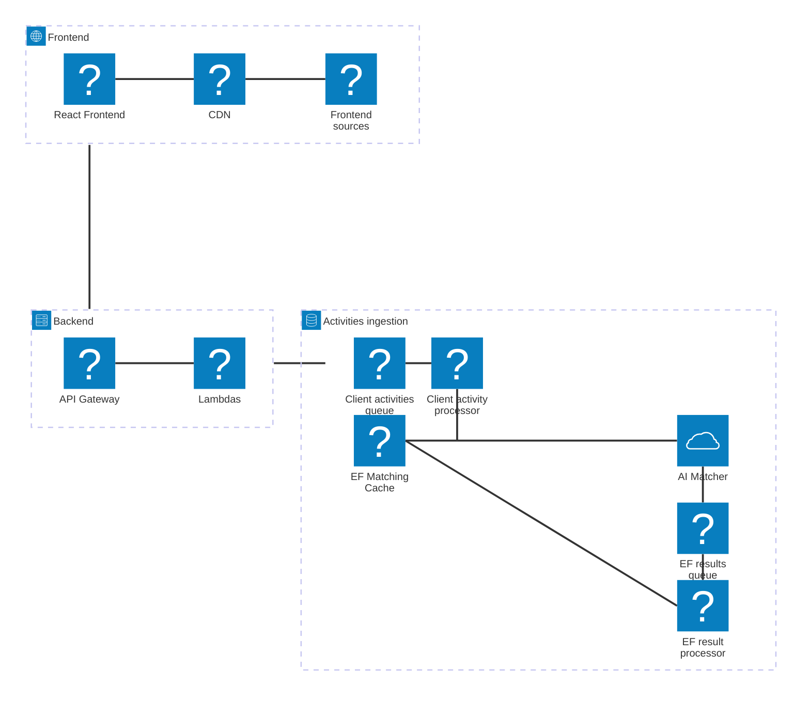

# Terrascope Case Study

## High-level diagram

```mermaid
architecture-beta
  group activity-ingestion(database)[Activities ingestion]
    service client-activity-queue(logos:aws-sqs)[Client activities queue] in activity-ingestion
    service client-activity-processor(logos:aws-lambda)[Client activity processor] in activity-ingestion
    service ai-matcher(cloud)[AI Matcher] in activity-ingestion
    service ef-results-queue(logos:aws-sqs)[EF results queue] in activity-ingestion
    service ef-results-processor(logos:aws-lambda)[EF result processor] in activity-ingestion
    service ef-matching-cache(logos:aws-dynamodb)[EF Matching Cache] in activity-ingestion

    junction cache-check

    client-activity-queue:R -- L:client-activity-processor
    client-activity-processor:B -- T:cache-check
    cache-check:R -- L:ai-matcher
    cache-check:L -- R:ef-matching-cache
    ai-matcher:B -- T:ef-results-queue
    ef-results-queue:B -- T:ef-results-processor
    ef-results-processor:L -- R:ef-matching-cache

  group backend(server)[Backend]
    service api-gateway(logos:aws-api-gateway)[API Gateway] in backend
    service lambdas(logos:aws-lambda)[Lambdas] in backend

    api-gateway:R -- L:lambdas
    lambdas{group}:R -- L:client-activity-queue{group}

  group frontend(internet)[Frontend]
    service browser(logos:react)[React Frontend] in frontend
    service cdn(logos:aws-cloudfront)[CDN] in frontend
    service frontend-bucket(logos:aws-s3)[Frontend sources] in frontend

    browser:R -- L:cdn
    browser{group}:B -- T:api-gateway{group}
    cdn:R -- L:frontend-bucket

```
